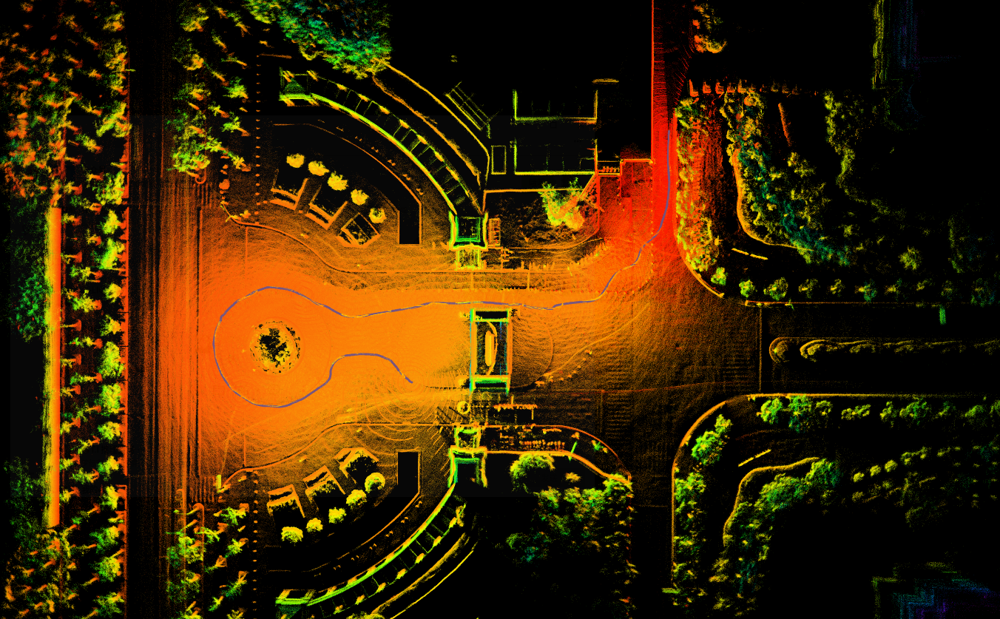
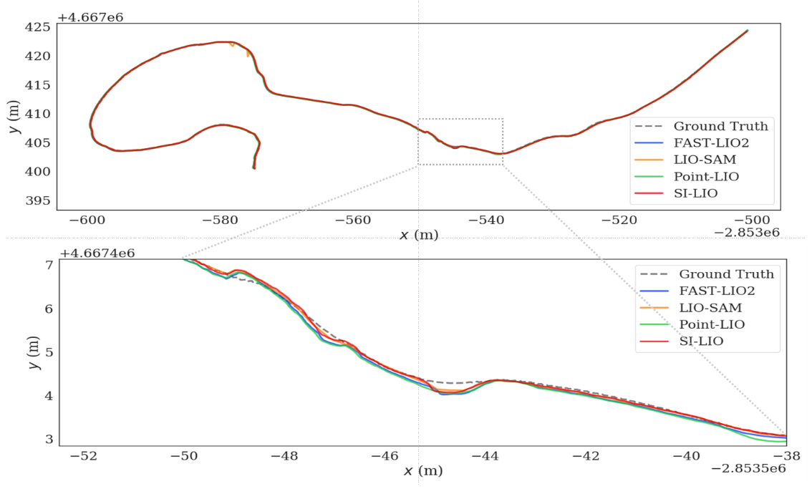

# SI_LIO
**SI_LIO** is based on the Invariant-EKF theory and our code is implemented on S-FAST_LIO.
<p align="center" style="display: flex; justify-content: center;">
    
    
</p>

In some cases, our accuracy is higher than that of fast-lio2.

## 1. Dependices
Sophus
Eigen
PCL
livox_ros_driver

## 2. Build
Clone the repository and catkin_make:

```
cd ~/catkin_ws/src
git clone https://github.com/USTC-AIS-Lab/SI-LIO.git
cd ../
catkin_make -j
source ~/catkin_ws/devel/setup.bash
```

## 3. Run
We recommend using the [M2DGR](https://github.com/SJTU-ViSYS/M2DGR) dataset.
```
roslaunch inva_fast_lio mapping_velodyne_m2dgr.launch
rosbag play street_04.bag
```

## 4. Acknowledgements
Thanks for the authors of [S-FAST-LIO](https://github.com/zlwang7/S-FAST_LIO.git) and [FAST-LIO](https://github.com/hku-mars/FAST_LIO).

